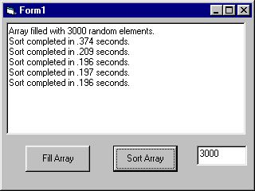



## QuickSort with Multiple Keys

### Description

This example performs a quicksort on multiple keys, on an array of UDT's in memory.
 
### More Info
 

             |
---                |---
**Submitted On**   |2000-10-17 21:21:40
**By**             |[Kamilche](https://github.com/Planet-Source-Code/PSCIndex/blob/master/ByAuthor/kamilche.md)
**Level**          |Intermediate
**User Rating**    |4.8 (29 globes from 6 users)
**Compatibility**  |VB 4\.0 \(32\-bit\), VB 5\.0, VB 6\.0, VB Script
**Category**       |[Data Structures](https://github.com/Planet-Source-Code/PSCIndex/blob/master/ByCategory/data-structures__1-33.md)
**World**          |[Visual Basic](https://github.com/Planet-Source-Code/PSCIndex/blob/master/ByWorld/visual-basic.md)
**Archive File**   |[CODE\_UPLOAD1073610182000\.zip](https://github.com/Planet-Source-Code/kamilche-quicksort-with-multiple-keys__1-12117/archive/master.zip)

